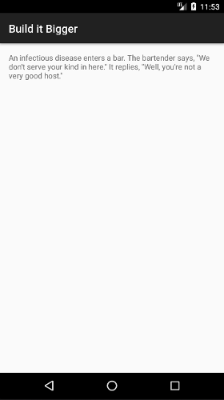

# Build it Bigger

Build it Bigger is the fourth app of my Udacity Android Developer Nanodegree. It focuses on building multiple modules with Gradle. The app depends on an App Engine module, a Java Joke library module (which feeds the jokes to App Engine), and an Android library which handle the UI for displaying a joke. All build dependencies are handled through Gradle. The app also contains a "free" version that displays interstitial ads and a "paid" version without ads.

# Screenshots





# Installation Details

In order to successfully run the app and have it display jokes, it should be run in an emulator and a local App Engine development server should also be running on the same machine. The App Engine (backend) module can be run either by selecting the ```backend``` configuration in Android Studio and clicking the run button or by running the following Gradle command:

```
gradlew :backend:appengineRun
```

Once you are done testing the app, the following Gradle command can be run to stop the server:

```
gradlew :backend:appengineStop
```
